# Table of Contents
<!-- MDTOC maxdepth:6 firsth1:0 numbering:1 flatten:0 bullets:1 updateOnSave:0 -->
- [Summary](#pSummary)

- [Synthesis and purposes](#pSynthesis)

- [1. Geomagnetic components in shortness](#p1)

    - [1.1 Usual procedure for obtaining continuous geomagnetic components](#p1_1)

    - [1.2 Discrete absolute measurements](#p1_2)

    - [1.3 Notes on building characteristics of flux-gate magnetometers](#p1_3)

        - [1.3.1 Mechanics of sensors system](#p1_3_1)

        - [1.3.2 Dynamic range of the sensors](#p1_3_2)

    - [1.4 Common interlude to the two types of sensor tern](#p1_4)

- [2. Essential flowchart of data processing in a geomagnetic observatory](#p2)

- [3. Variometric sensors on fixed tern, approach to the problem](#p3)

    - [3.1 Calculation of sensor rotation matrix applying least squares method](#p3_1)

    - [3.2 Estimate of residuals between the experimental values _XAID_,_YAID_,_ZAID_ and the values _XVAR_,_YVAR_,_ZVAR_ rotated by sensor matrix](#p3_2)

    - [3.3 Estimate of the residuals interpolations and their addition to the _XVAR_,_YVAR_,_ZVAR_ values rotated by the sensor matrix](#p3_3)

- [4. Variometric sensors arranged on cardanic suspension, approach to the problem](#p4)

    - [4.1 Calculation of rotation matrix for the _XVAR_ and _YVAR_ components orthogonal to each other and lying in the horizontal plane, applying the least squares method](#p4_1)

    - [4.2 Estimate of residuals between the experimental values _XAID_,_YAID_ and the values _XVAR_,_YVAR_ rotated by sensor matrix](#p4_2)

    - [4.3 Estimate of the residuals interpolations and their addition to the _XVAR_,_YVAR_ values rotated by the sensor matrix](#p4_3)

    - [4.4 Calculation of continuous _ZREA_ values](#p4_4)

- [5. Linear systems gained](#p5)

- [6. Important notes about time](#p6)

    - [6.1 Time for sensors disposed on fixed tern](#p6_1)

        - [6.1.1 Calculation of sensor matrix - see (50), (51), (52) and residuals _XRES_, _YRES_, _ZRES_ - see (25)](#p6_1_1)

        - [6.1.2 Interpolation of the discrete series _XRES_, _YRES_, _ZRES_ in order to estimate the _XFitRES_, _YFitRES_, _ZFitRES_ continuous series - see (26)](#p6_1_2)

    - [6.2 Time for sensors disposed on cardanic suspension](#p6_2)

        - [6.2.1 Sensor matrix calculation - see (53), (54) and residuals _XRES_, _YRES_ calculation - see (46)](#p6_2_1)

        - [6.2.2 Interpolation of the discrete series _XRES_, _YRES_ in order to estimate the _XFitRES_, _YFitRES_ continuous series - see (47)](#p6_2_2)

- [7. Conclusions](#p7)

- [Acknowledgments](#pAcknowledgments)

- [Bibliography](#pBibliography)
<!-- /MDTOC -->

## Procedures to obtain *XYZ* cartesian geomagnetic components from flux-gate magnetometer measures (on Earth\'s observatories)

mr. Michele Di Savino, <michele.disavino@ingv.it>

## Summary
The overall Earth\'s Magnetic Field, springs from the influence of multiple, non-separable, effects: ionosphere variations, own dipole magnetism, magnetic induction of the soil. It greatly conditions human life in frequently used civilian apparatuses and technologies; magnetic measurements are also carried out in non-invasive contexts such as medical diagnostics, environmental protection, energy and mining research, archeology, etc. 
Ultimately, a number not at all small of human activities is influenced, directly or indirectly, by natural or artificial magnetic variations. Their monitoring therefore presents a certain importance; it is usually carried out by magnetometers located in sites with low electromagnetic noise level. They are detection tools that have followed the evolution of science and technology, becoming increasingly simple, stable, compact, precise and resolving.  
This discussion is going to expose a data processing methodology supplied by a typical flux-gate sensors system, or in any case assimilable to it, aimed at calculating the fundamental geomagnetic elements in the cartesian reference trying to exploit to a greater extent the benefits deriving from an improved instrumentation.

## Synthesis and purposes
The flux-gate magnetometer (later: FGM), generally provides vectorial measurements of the magnetic induction along three directions which are slightly different from the three geographical directions looked for: North-South, East-West and Vertical.  
The following elaborations aim to obtain the correct magnetic components in the geographical reference.  
Simultaneously, they implement a correction of the mechanical imbalance of the sensor system due to slow natural variations of the ground level or the occurrence of seismic events, of such intensity as to randomly shift the original position of the sensors.   
This report does not want to delve into peculiar aspects such as electronic excitation waveforms employed, sensor ferromagnetic characteristics, signal filters, adoption of technologies or components suitable for minimizing temperature effects, etcetera.  
The FGM is considered in its most generic form; only two characteristics will be discussed in this report:
  -Sensors positioned in fixed tern or tern provided of cardanic suspension; the two mathematical procedures are obviously different, even if conceptually identical.
  -Dynamic range of the considered instrument. This is a transparent aspect for the elaborations to be performed, it managed by properly initializing three numerical variables: one for each recorded component *X*, *Y* and *Z*.

## 1. Geomagnetic components in shortness
Next diagram shows the main elements used to describe the Earth\'s magnetic field:  

  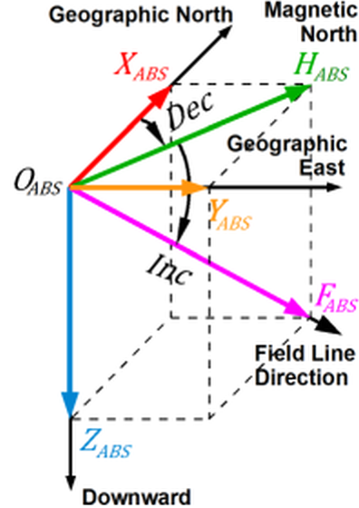  
**Figure 1.** Geomagnetic field elements

Considering a point _OABS_ (*ABS*, i.e. absolute reference) on the Earth surface, the  magnetic induction vector passing through it, whatever it may be, can be decompose as a vector sum of three others:  
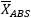 directed along the geographical meridian, towards the North positive;  
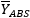 directed along the geographical parallel, towards the East positive;  
 directed along the vertical, downwards positive.  

The result is the relation: 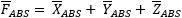, while  is the projection of  on the horizontal plane and therefore the following expressions also subsist:
 and .

In addition, we define:  
 declination angle, is the angle between geographic north and magnetic north; it is positive if  is directed to East.  
 inclination angle, is the angle between horizontal plane and the  vector; it is positive if  is directed downwards.  
 ,  and  form an orthogonal triplet of vectors oriented according to the geographic reference plus the vertical direction to the ground.  

## 1.1 Usual procedure for obtaining continuous geomagnetic components
The absolute components _XABS, YABS, ZABS_ play the fundamental role of reference measures.
The FGM provides continuous measurements of the geomagnetic field always in a three vector quantities likewise to the geographic reference, but in a different pseudo-random reference called variometric (later: *VAR*, variometric reference).  
To return the continuous measurements made in the *VAR* reference into corresponding continuous and virtual values but in the *ABS* reference, the homologous *ABS*-*VAR* differences (i.e. baselines) are calculated at the time of absolute measurements.  
These discrete differences are interpolated along the appropriate time interval and through mathematical inversion, the virtual *ABS* values are computed for all the time of the continuous readings in the *VAR* reference, for each of the three *XYZ* components.  

## 1.2 Discrete absolute measurements
The knowledge of the absolute geomagnetic components ,  and  is generally achieved by measuring the magnetic angles  and  and knowing the value  at corresponding time.  
These measurements are manual and therefore discrete.  

The magnetic angles  and  are found by rotating, by means of a demagnetized theodolite, along the horizontal and vertical circles, a magnetic field vector detector in search of the positions in which there is a value of the null field, (appliance named DIM, i.e. Declination Inclination Magnetometer), \[[Jankowski and Sucksdorff, 1996](#bIAGA)\].  

The aforementioned  value is obtained from the measurement of a scalar magnetometer, usually a proton precession magnetometer or Overhauser effect magnetometer (later: SM scalar magnetometer), in permanently acquisition.  

If necessary, the  module should be mathematically varied through a periodically verified constant, which takes into account the magnetic gradients between the various spots of the observatory where the measuring instruments are stood, see next [Figure 2](#Fig2).  

## 1.3 Notes on building characteristics of flux-gate magnetometers
Only two aspects of the used *VAR* instrument are taken into consideration here; according to these different characteristics, the mathematical procedures adopted vary.  

## 1.3.1 Mechanics of sensors system
The FGMs have terns of geomagnetic sensors with building characteristics of two main types:  
fixed tern consisting of mutually orthogonal *X*,*Y*,*Z* sensors  
and  
tern composed of sensors arranged on a gimbal: the direction of *Z* sensor is always vertical by gravity while *X* and *Y* sensors, orthogonal to each other, are placed in a normal plane respect *Z* direction.  

## 1.3.2 Dynamic range of the sensors
The first FGM generations had a limited dynamic range, in fact each sensor worked artificially in a magnetic field around zero because otherwise the value of magnetic induction present would have easily saturated the sensor itself.  
In this case the flux-gate sensors measured practically some variations, these last values went add to the main portions of magnetic component.  
Each sensor core, was therefore equipped of electromagnetic compensation.  
FGM characteristics of some IMO; (i.e. Intermagnet Magnetic Observatory).  
DYNAMIC RANGE:  +/- 5000 nT (EBR, esp)  
DYNAMIC RANGE:   +/- 500 nT (SPT, esp)  
DYNAMIC RANGE:      6500 nT (LZH, chn)  
\[[INTERMAGNET organization, 2014](#bIntermagnetDVD2010)\].  

The most advanced generations of FGM are designed with such a wide dynamic range as to exceed the measurable magnetic field induction value on the earth\'s surface.  
In this event, the artificial electronic compensations of the three sensor cores are useless:  
DYNAMIC RANGE:   Full field (all can)  
DYNAMIC RANGE: +/- 80000 nT (all usa)  
DYNAMIC RANGE: +/- 70000 nT (CLF, fra)  
\[[INTERMAGNET organization, 2014](#bIntermagnetDVD2010)\].  

In the following, we will refer to *VAR* instruments with low dynamic range value, which therefore require an electronic compensation.  
The treatment of the *VAR* instruments typology with a sufficiently high dynamic range is simpler, potentially more precise and it does not require formal changes to the procedures.  
See next [§§3](#p3), [§§4](#p4).  

## 1.4 Common interlude to the two types of sensor tern

Taking into account the differences described in previous [§1.3.1](#p1_3_1) and [§1.3.2](#p1_3_2), fundamentally, resolutions can be implemented through variation of magnetic coordinates between the *VAR* reference (variometric and known) of departure, and the *ABS* reference (absolute and unknown) of arrival, for the homologous *XYZ* components.
   The solutions for tern equipped with fixed sensors and tern provided with sensors positioned on cardanic joint will be discussed, respectively, in [§§3](#p3) and [§§4](#p4).
  The [§5](#p5) will present the full mathematical solutions for the two systems.
  The [§§6](#p6) will argue the temporal conventions proposed for the resolution of the two types of sensors.
  The last [§7](#p7) will compare the described methodology against the traditional procedure grounded on single baselines values reckoning.

## 2. Essential flowchart of data processing in a geomagnetic observatory
The diagram highlights the different sites where the various instruments are positioned, they placed at a sufficient distance so as not to influence each other on the measurements taken.

  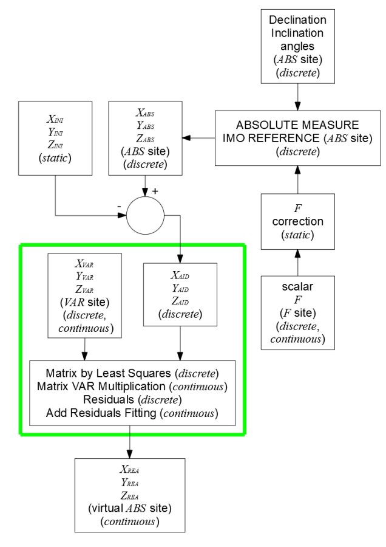  
**Figure 2.** Flowchart of geomagnetic data processing

The term ***static*** indicates numerical values, which under certain conditions, can be assumed constant.  
The ***discrete*** wording signals discrete data.  
The word ***continuous*** indicates continuous data.  
The green box delimits the core of the particular procedures.

## 3. Variometric sensors on fixed tern, approach to the problem
Recalling [Figure 1](#Fig1), we consider:  
-number _N_ ordered triplets (_XABS,YABS,ZABS_) composed of magnetic induction values of the discrete absolute measurements obtained by DIM: this reference system originates in _OABS_.

We define two magnetic points:  
_OVAR_ is the origin of the variometric tern of continuous magnetic measurements; these last values are recorded by FGM,  
_OREA_ is the origin of the tern of continuous virtual magnetic values that are calculated through the current procedure.

[Figure 3](#Fig3) shows the situation described:

    
**Figure 3.** Geomagnetic components read from the FGM variometer in its _OVAR_ reference (left), and transition to the real components in the _OREA_ reference (right)

The arrival origin is denominated _OREA_, but the components _XREA, YREA, ZREA_ calculated at the end through the transformation are virtual and they refer to the origin _OABS_, which is the observatory reference.  
Thus, virtually, _OREA_ is equivalent to _OABS_.  

We consider also:  
-ordered triplets (_XVAR,YVAR,ZVAR_) sampled at regular intervals by a set of three mutually orthogonal flux-gate sensors with unknown orientation.  
The sensors ensemble is laid in the _OVAR_ point; this last is distinct from the _OABS_ point.  

-ordered triplet (_XINI,YINI,ZINI_).  
Two cases must be separated according to the dynamic range characteristic of the *VAR* instrument used, see [§1.3.2](#p1_3_2).  

High dynamic range.  
In this case, it is sufficient to void the ordered triplet in question:
  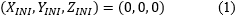  
in all the subsequent formulas involved.

Low dynamic range.  
Due to calculation mode that will be exposed starting from the next paragraph, it is necessary to estimate the values of the absolute *X*,*Y*,*Z* components in the _OVAR_ point at the moment when the orientation of the sensors ensemble happens.
 
These values can be estimated quite easily through the execution of a concurrent absolute measurement, in fact it results:
    

where:  
_XABS,YABS,ZABS_ are the values obtained from the absolute measurement calculation,
  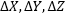 represent the magnetic induction gradients between the *ABS* (i.e. DIM) and *VAR* (i.e. FGM) sites for the three components.  
The  gradients are nearly constant quantities, at least in the short term, and it is good practice to check them periodically. Undoubtedly more steady and small these quantities remain in time and better the quality of the geomagnetic observatory is.  

Finally, at the same time, it is necessary to void electronically (_XVAR,YVAR,ZVAR_) on the *VAR* instrument, preferably in sync with the measurer on the DIM.  

Once the sensor is set, if there are compensations (i.e. instrument with low dynamic range), the same adjustments must no longer be changed.  

## 3.1 Calculation of sensor rotation matrix applying least squares method
In this first phase, we consider the subset of _N_ ordered triplets (_XVAR,YVAR,ZVAR_) that matches to the time of the _N_ discrete absolute measurements (_XABS,YABS,ZABS_).  

With contribution of the constant ordered triplet (_XINI,YINI,ZINI_), we can consider the usual mathematical expression that binds two generic orthogonal three-dimensional magnetic references:
  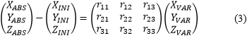  

where r11,r12,r13,r21,r22,r23,r31,r32,r33 are the nine elements of the _R3x3_ rotation matrix; they correlate the values read on the *VAR* site with the real values present on the *ABS* (or DIM) site.  
For the calculation of this _R3x3_ matrix we only takes into account absolute measurements and variometer readings (*VAR* subscript), at discrete instants corresponding.  
Such matrix is calculated with the contribution of the total signals of the FGM and, therefore, it takes into account also the undesired causes that can influence the long-term measurements: temperature drifts, electronic drifts and even mechanical leveling of the *VAR* instrument sensors ensemble.  
By carrying out, we have:
  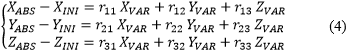  

to the first members of the three expressions, the following substitutions can be effectuated:  
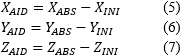  
*AID* subscript (i.e. *Abs Ini Difference*)

and the system becomes:
    

The three equations constituting (8) can be separated because the numerical values *AID* and *VAR* are known and imposed by extraction or calculation data.  
We consider only the first equation included in (8):
  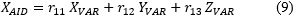  
and we examine the _N_ experimental values of the quantities reported.

The values of r11,r12,r13 that best approximate the _N_ experimental values of _XAID_, _XVAR_, _YVAR_, _ZVAR_ bound by the relation (9) in the least squares sense, are obtained in the usual way by constructing the deviation:
    

and raising it to square:
  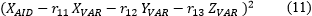  

The evolution _E_ of the square deviation, for the _N_ samples of _XAID_, _XVAR_, _YVAR_, _ZVAR_ is:
  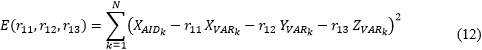  

The minimum of _E(r11,r12,r13)_ can be calculated by imposing the simultaneous annulment of the partial derivatives of _E_ in the variables r11,r12,r13:
    

The satisfaction of this condition leads to the resolution of a linear system of rank 3 in which the unknowns are r11,r12,r13.  

First row of system:
  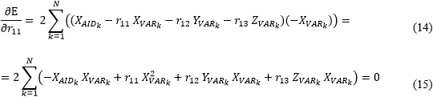  

i.e.
  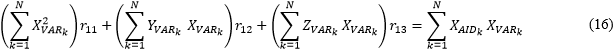  

Second row of system:
  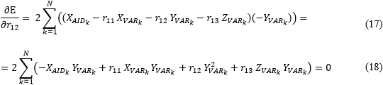  

i.e.
  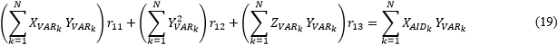  

Third row of system:
    

i.e.
    

The six remaining elements r21,r22,r23 and r31,r32,r33 of the rotation matrix are obtained by two analogous procedures applying the right experimental data series to the equations:
  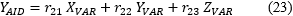  
and
    
of the system [\(8\)](#eq8).

## 3.2 Estimate of residuals between the experimental values _XAID_,_YAID_,_ZAID_ and the values _XVAR_,_YVAR_,_ZVAR_ rotated by sensor matrix
The information achieved through the compute of the _R3x3_ rotation matrix will be subsequently integrated using residuals between the experimental absolute values (_XAID,YAID,ZAID_) and the values (_XVAR,YVAR,ZVAR_) detected by the variometer and afterwards rotated, at the time of absolute measurements performed.  
These discrete residuals, for each of the _N_ points, are calculated as following:  
  
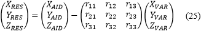  

## 3.3 Estimate of the residuals interpolations and their addition to the _XVAR_,_YVAR_,_ZVAR_ values rotated by the sensor matrix
Interpolating these _N_ ordinated triplets of discrete residuals (_XRES,YRES,ZRES_) calculated from (25) with their appropriate independent time variables, for the whole interval time involved, we obtain the continuous ordinated triplets (_XFitRES,YFitRES,ZFitRES_) that provide the optimal corrections to be add to the contribution of the continuous values (_XVAR,YVAR,ZVAR_) multiplied for the rotation matrix of the sensor:  
  
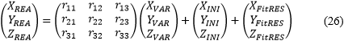  

The real values (_XREA,YREA,ZREA_) calculated are relative to the *ABS* (or DIM) site, but they obtained physically from the corresponding numerical values (_XVAR,YVAR,ZVAR_) continuously recorded by the flux-gate *VAR* instrument with random orientation.

Due to the execution of absolute measurements through DIM and the mathematical techniques adopted, the practical implementation of the methods exposed requires considerations on the time of both the absolute measurements performed *XYZF AID* and the data considered *XYZF VAR*: one of these possibilities will be presented in the last [§§6](#p6).  
Until debate these paragraphs, the procedures developed will not take into account of precise time.

## 4. Variometric sensors arranged on cardanic suspension, approach to the problem
Recalling [Figure 1](#Fig1), we consider:  
-number _N_ ordered pairs (_XABS,YABS_) and _ZABS_ quantities composed of magnetic induction values of the discrete absolute measurements obtained by DIM: this reference system originates in _OABS_.

We define two magnetic points:  
_OVAR_ is the origin of the variometric tern of continuous magnetic measurements; these last values are recorded by FGM,  
_OREA_ is the origin of the tern of the continuous virtual magnetic measurements that are calculated through the current procedure.

[Figure 4](#Fig4) shows the situation described:

    
**Figure 4.** Geomagnetic components read from the FGM variometer in its _OVAR_ reference (left), and transition to the real components in the _OREA_ reference (right)

The arrival origin is denominated _OREA_, but the components _XREA, YREA, ZREA_ calculated at the end through the transformation are virtual and they refer to the origin _OABS_, which is the observatory reference.  
Thus, virtually, _OREA_ is equivalent to _OABS_.  

We consider also:  
-ordered pairs (_XVAR,YVAR_) and _ZVAR_ quantities sampled at regular intervals by a set of three flux-gate vectorial sensors arranged on a cardanic joint.  
The sensors ensemble is laid in the _OVAR_ point; this last is distinct from the _OABS_ point.  

The sensors tern which measure (_XVAR,YVAR_) and _ZVAR_ is suspended and the vertical along the direction of the weight force and the sensitive direction of the _ZVAR_ component coincide, so _ZVAR_ really measures a quantity proportional to the real vertical component _ZREA_.  
Based on the mechanical construction of the sensors ensemble, the other two sensitive directions _XVAR_ and _YVAR_ of the flux-gate tern are orthogonal to each other and both orthogonal to the sensitive direction of the _ZVAR_ component.  
Although the sensitive direction of the _ZVAR_ component is always vertical, the horizontal plane can rotate around the vertical axis and therefore the directions of the _XVAR_ and _YVAR_ components are not immutable.  

-ordered triplet (_XINI,YINI,ZINI_).  
Two cases must be separated according to the dynamic range characteristic of the *VAR* instrument used, see [§1.3.2](#p1_3_2).  

High dynamic range.  
In this case, it is sufficient to void the ordered triplet in question:
  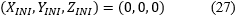  
in all the subsequent formulas involved.

Low dynamic range.  
Due to calculation mode that will be exposed starting in the next paragraph, it is necessary to estimate the values of the absolute *X*,*Y*,*Z* components in the _OVAR_ point at the moment when the orientation of the sensors ensemble happens.
 
These values can be estimated quite easily through the execution of a concurrent absolute measurement, in fact it results:
    

where:  
_XABS,YABS,ZABS_ are the values obtained from the absolute measurement calculation,
   represent the magnetic induction gradients between the *ABS* (i.e. DIM) and *VAR* (i.e. FGM) sites for the three components.  
The  gradients are nearly constant quantities, at least in the short term, and it is good practice to check them periodically. Undoubtedly more steady and small these quantities remain in time and better the quality of the geomagnetic observatory is.  

Finally, at the same time, it is necessary to void electronically (_XVAR,YVAR,ZVAR_) on the *VAR* instrument, preferably in sync with the measurer on the DIM.  

Once the sensor is set, if there are compensations (i.e. instrument with low dynamic range), the same adjustments must no longer be changed.  

The presence of the cardan joint allows to separate the elaborations for the (_XVAR,YVAR_) ordered pairs, see [§4.1](#p4_1), [§4.2](#p4_2) e [§4.3](#p4_3); from the elaborations concerning the _ZVAR_ components, see [§4.4](#p4_4).  

## 4.1 Calculation of rotation matrix for the _XVAR_ and _YVAR_ components orthogonal to each other and lying in the horizontal plane, applying the least squares method
Unlike the fixed tern sensor, the elaboration for _XAID_, _YAID_, _XVAR_, _YVAR_ is completely separate from the one concerning _ZAID_, _ZVAR_.   
In this first phase, we consider the subset of _N_ ordered pairs (_XVAR,YVAR_) that matches to the time of the _N_ discrete absolute measurements (_XABS,YABS_).  

With contribution of the constant ordered pair (_XINI,YINI_), we can consider the usual mathematical expression that binds two generic orthogonal bi-dimensional magnetic references:
  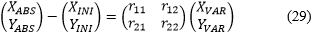  

where r11,r12,r21,r22 are the four elements of the _R2x2_ rotation matrix; they correlate the values read on the *VAR* site with the real values present on the *ABS* (or DIM) site.  
For the calculation of this _R2x2_ matrix we only takes into account absolute measurements and variometer readings (*VAR* subscript), at discrete instants corresponding.  
Such matrix is calculated with the contribution of the total signals of the FGM and, therefore, it takes into account also the undesired causes that can influence the long-term measurements: temperature drifts, electronic drifts and even mechanical leveling of the *VAR* instrument sensors ensemble.  
By carrying out, we have:
  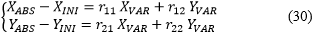  

to the first members of the two expressions, the following substitutions can be effectuated:  
  
*AID* subscript (i.e. *Abs Ini Difference*)

and the system becomes:
  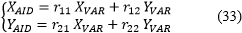  

The two equations constituting (33) can be separated because the numerical values *AID* and *VAR* are known and imposed by extraction or calculation data.  
We consider only the first equation included in (33):  
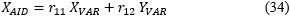  
and we examine the _N_ experimental values of the quantities reported.

The values of r11,r12 that best approximate the _N_ experimental values of _XAID_, _XVAR_, _YVAR_ bound by the relation (34) in the least squares sense, are obtained in the usual way by constructing the deviation:
    

and raising it to square:
  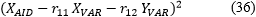  

The evolution _E_ of the square deviation, for the _N_ samples of _XAID_, _XVAR_, _YVAR_ is:
  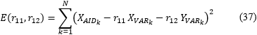  

The minimum of _E(r11,r12)_ can be calculated by imposing the simultaneous annulment of the partial derivatives of _E_ in the variables r11,r12:
    

The satisfaction of this condition leads to the resolution of a linear system of rank 2 in which the unknowns are r11,r12.  

First row of sistem:
    

i.e.
    

Second row of sistem:
    

i.e.
    

The two remaining elements r21,r22 of the rotation matrix are obtained by analogous procedure applying the right experimental data series to the equation:
    
of the system [\(33\)](#eq33).

## 4.2 Estimate of residuals between the experimental values _XAID_,_YAID_ and the values _XVAR_,_YVAR_ rotated by sensor matrix
The information achieved through the compute of the _R2x2_ rotation matrix, will be subsequently integrated using residuals between the experimental absolute values (_XAID_,_YAID_) and the values (_XVAR_,_YVAR_) detected by the variometer and afterwards rotated, at the time of absolute measurements performed.  
These discrete residuals, for each of the _N_ points, are calculated as following:  
  
  

## 4.3 Estimate of the residuals interpolations and their addition to the _XVAR_,_YVAR_ values rotated by the sensor matrix
Interpolating these _N_ ordinated pairs of discrete residuals (_XRES,YRES_) calculated from (46) with their appropriate independent time variables, for the whole interval time involved, we obtain the continuous ordinated pairs (_XFitRES,YFitRES_) that provide the optimal corrections to be add to the contribution of the continuous values (_XVAR,YVAR_) multiplied for the rotation matrix of the sensor:  
  
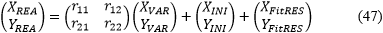  

The real values (_XREA,YREA_) calculated are relative to the *ABS* (or DIM) site, but they obtained physically from the corresponding numerical values (_XVAR,YVAR_) continuously recorded by the flux-gate *VAR* instrument with random orientation.

Due to the execution of absolute measurements through DIM and the mathematical techniques adopted, the practical implementation of the methods exposed requires considerations on the time of both the absolute measurements performed *XYZF AID* and the data considered *XYZF VAR*: one of these possibilities will be presented in the last [§§6](#p6).  
Until debate these paragraphs, the procedures developed will not take into account of precise time.

## 4.4 Calculation of continuous _ZREA_ values
The sensitive element of the vector component _ZVAR_ always assumes a vertical orientation due to the mechanical construction of the sensor tern, therefore for each value of the continuous sampling _ZVAR_, the corresponding continuous value _ZREA_ immediately descends:
    

Where the continuous values _ZFitBAS_ are obtained preliminarily by the interpolation of the baseline terms _ZBAS_ of discrete absolute measurements and calculated individually as:
  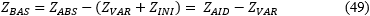  

In the building of continuous series _ZFitBAS_, it has been chosen to repeat the only _ZBAS_ value computed for each single minute concerning the inclination measurement.  
These interpolations have independent variables represented by right inclination measure time.  

Instead, to evaluate the discrete value of (49), _ZABS_ (i.e. _ZAID_) is the only calculated value, while _ZVAR_ is obtained by computing the average between all the values of _ZVAR_ registered at the inclination time of the absolute measure considered.

## 5. Linear systems gained
Linear systems for calculating matrices of rotation, for both types of *VAR* sensor, are shown for completeness below:

sensors on fixed tern:
  
  

  
  

  
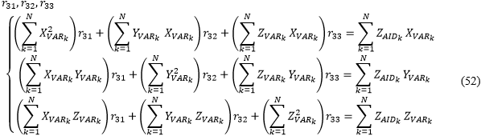  

sensors on gimbal:
  
  

  
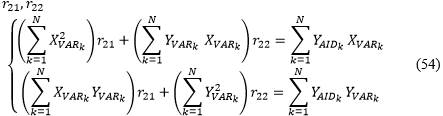  

Like we can verify, in the linear systems of order 3 (or 2), the incomplete matrices remain constant, instead the matrices of known terms varies, depending on the rows of the rotation matrix to calculate.

## 6. Important notes about time
The next diagram focalizes the time of a typical absolute measure (from [Figure 1](#Fig1)\):

    
**Figure 5.** Time of execution DIM measure  
  \[[Jankowski and Sucksdorff, 1996](#bIAGA)\].  
For a correct application of the methodologies, for each absolute measure, all the components must be present:
  Both ordered triplets (_XAID,YAID,ZAID_) and (_XVAR,YVAR,ZVAR_), for sensors on fixed tern.
  Both ordered pairs (_XAID,YAID_) and (_XVAR,YVAR_), for tern equipped with tilting suspension.
  This can be verified by looking at the available data.

Each absolute measure considered should be executed in an instant; this does not usually occur, in fact for an absolute measure, the declination and inclination readings can take more minutes.  
Follow some proposals for to implement time in procedures.

## 6.1 Time for sensors disposed on fixed tern

## 6.1.1 Calculation of sensor matrix - see [\(50\)](#eq50), [\(51\)](#eq51), [\(52\)](#eq52) and residuals _XRES_, _YRES_, _ZRES_ - see [\(25\)](#eq25)

In the computation of these elements take part the _N_ ordered triplets (_XAID,YAID,ZAID_) and (_XVAR,YVAR,ZVAR_), considered at the time of the discrete absolute measurements.  
Both the rotation matrix _R3x3_ and the ordered discrete triplets (_XRES,YRES,ZRES_) achieved, derive from the least squares calculation and they are not concerning to specific time.  

The values that compose (_XAID,YAID,ZAID_), as seen in [Figure 5](#Fig5) above, are certainly measured in not negligible time intervals but, considering that in the calculation of the least squares the values of time are irrelevant, we simply assume each absolute measurement as a single entity.  

The (_XVAR,YVAR,ZVAR_) values instead can be chosen among all those continuously measured by the *VAR* instrument, at the time involved in the absolute measurement, namely:  
Calculation of the average among all the _XVAR_ (or _YVAR_) values acquired in the time of declination measure, together with those acquired in the time of inclination measure.  
Calculation of the average among all the _ZVAR_ values acquired in the time of inclination measure.  

## 6.1.2 Interpolation of the discrete series _XRES_, _YRES_, _ZRES_ in order to estimate the _XFitRES_, _YFitRES_, _ZFitRES_ continuous series - see [\(26\)](#eq26)
The _N_ discrete ordered triplets (_XRES,YRES,ZRES_) take part in the calculation of these interpolations, with independent variables the time of the absolute measurements.  
As reported in the previous [§6.1.1](#p6_1_1), also the ordered triples (_XRES,YRES,ZRES_) are considered like entities dependent on the determined absolute measure, but without associated time.  

The continuous ordered triplets (_XFitRES,YFitRES,ZFitRES_) are obtained by interpolating, through the chosen method, the discrete ordered triplets (_XRES,YRES,ZRES_) considering the appropriate time intervals.  
To this end, specific time have been reintroduced coherently with the logical paths shown in [Figure 5](#Fig5):  
To calculate the _XFitRES_ (or _YFitRES_) series, the _XRES_ (or _YRES_) values have been interpolated with independent variables the declination time joined with the inclination time, of the particular absolute measurement.  
To calculate the _ZFitRES_ series, the _ZRES_ values have been interpolated with independent variables the inclination time of the particular absolute measurement.  

Moreover:  
The same value of _XRES_ (or _YRES_) associated with the absolute measure considered, has been repeated for every single minute that constitutes the time interval of the declination and inclination.  
With similar policy, the _ZRES_ value associated with the absolute measure considered, has been repeated for every single minute that constitutes the time interval of the inclination.

## 6.2 Time for sensors disposed on cardanic suspension

## 6.2.1 Sensor matrix calculation - see [\(53\)](#eq53), [\(54\)](#eq54) and residuals _XRES_, _YRES_ calculation - see [\(46\)](#eq46)
In the computation of these elements take part the _N_ ordered pairs (_XAID,YAID_) and (_XVAR,YVAR_), considered at the time of the discrete absolute measurements.
  Both the _R2x2_ rotation matrix  and the ordered discrete pairs (_XRES,YRES_), derive from the least squares calculation and they are not concerning to specific time.

The values that compose (_XAID,YAID_), as seen in [Figure 5](#Fig5) above, are certainly measured in not negligible time intervals but, considering that in the calculation of the least squares the values of time are irrelevant, we simply assume each absolute measurement as a single entity.

The (_XVAR,YVAR_) values instead can be chosen among all those continuously measured by the *VAR* instrument, at the time involved in the absolute measurement, namely:  
Calculation of the average among all _XVAR_ (or _YVAR_) values acquired in the time of declination measure, together with those acquired in the time of inclination measure.

## 6.2.2 Interpolation of the discrete series _XRES_, _YRES_ in order to estimate the _XFitRES_, _YFitRES_ continuous series - see [\(47\)](#eq47)
The _N_ discrete ordered pairs (_XRES,YRES_) take part in the calculation of these interpolations, with independent variables the time of the absolute measurements.  
As reported in the previous [§6.2.1](#p6_2_1), also the ordered pairs (_XRES,YRES_) are considered like entities dependent on the determined absolute measure, but without associated time.  

The continuous ordered pairs (_XFitRES,YFitRES_) are obtained by interpolating, through the chosen method, the discrete ordered pairs (_XRES,YRES_) considering the appropriate time intervals.  
To this end, specific time have been reintroduced coherently with the logical paths shown in [Figure 5](#Fig5):  
To calculate the _XFitRES_ (or _YFitRES_) series, the _XRES_ (or _YRES_) values have been interpolated with independent variables the declination time joined with the inclination time, of the particular absolute measurement.  

Moreover:  
The same value of _XRES_ (or _YRES_) associated with the absolute measure considered, has been repeated for every single minute that constitutes the time interval of the declination and inclination.

## 7. Conclusions
These conversion methods can be used indifferently for FGM sensors terns laid both on *HDZ* and *XYZ* orientation \[[Technical University of Denmark, 2014](#bDTU_Orie)\] or rather, like discussed, theoretically the orientation of the sensors system can be random.  

Logically, it is useful to regularly place the sensors ensemble in the *HDZ* or *XYZ* orientation and then combine both procedures:   
-Initially the one with traditional reduction formulas and calculation of single baseline values for a preliminary verification of the baselines: general control of the acquisition, electronic and temperature drifts or to build provisional data \[[Rigler, 2015](#bUSGS_Red); [DANISH METEOROLOGICAL INSTITUTE, TECHNICAL REPORT 04-14, 2004](#bDMI_Red)\].  
-Later, when all the data series will be available, it will be convenient to apply the described techniques with the use of least squares and residuals. This operation also compensate for the ground leveling and the definitive data are constructed.  

In the presence of known or random displacements due to earthquakes interesting the sensor tern, it is obviously advisable to perform absolute measurements as soon as possible after the event that has changed the position of the sensor system.   
If it result convenient, the data series can be appropriately split to increase the accuracy of the partial results.  
In the presence of FGM having low dynamic range values, it is generally not necessary to proceed with a new acquisition of initial values (_XINI,YINI,ZINI_).  
In fact, even if the position of the sensor tern is formally changed, if the laying site has a low magnetic gradient, the initial conditions are almost unaltered: the necessary precaution remains that of not modifying the initial electronic adjustments.  

Using the traditional reduction formulas, see [§1.1](#p1_1), a single numerical interpolation is performed on the baseline values (for each magnetic component); while with the method exposed the estimation is performed twice:  
\- the first one calculates the fixed rotation matrix: see [§3.1](#p3_1) for _R3x3_ or  [§4.1](#p4_1) for _R2x2_.  
\- the second one calculates the interpolation of the residuals to compensate the values produced by the rotation carried out by means the fixed matrix of the sensor: see [§3.3](#p3_3) for _R3x3_ or [§4.3](#p4_3) for _R2x2_.  

Evidently, this leads to an increase in computational error. On the other hand, these procedures are particularly suitable for FGM sensors installed in places characterized by a certain seismicity or subject to appreciable slow natural variations of ground level because they are based on \"true\" real values.
  For example, they allow to minimize the consequences of a random displacement of sensors ensemble on horseback an important seismic event.

## Acknowledgments
The results presented in this paper rely on data collected at magnetic observatories. We thank the national institutes that support them and INTERMAGNET for promoting high standards of magnetic observatory practice ([www.intermagnet.org](http://www.intermagnet.org)).

## Bibliography

DANISH METEOROLOGICAL INSTITUTE, TECHNICAL REPORT 04-14, (2004). *Magnetic Results 2003 Brorfelde, Qeqertarsuaq, Qaanaaq and Narsarsuaq Observatories.* DANISH METEOROLOGICAL INSTITUTE, Copenhagen, pp. 5.  
web page: <https://www.intermagnet.org/yearbooks/Denmark_2003.pdf>

Hitchman A.P., Crosthwaite P.G., Jones W.V., Lewis A.M., Wang L., (2011). *Australian Geomagnetism Report 2010, Volume 58*. Geoscience Australia, pp. 3.  
web page: <https://www.intermagnet.org/yearbooks/Australia_2010.pdf>

INTERMAGNET organization, (2012). *INTERMAGNET Technical Reference Manual Version 4.6.*  
web page: <https://www.intermagnet.org/publications/intermag_4-6.pdf>

INTERMAGNET organization, (2014). *MAGNETIC OBSERVATORY DEFINITE DATA, INTERMAGNET 2010,* Observatory Information, DVD ROM.

Jankowski J. and Sucksdorff C., (1996). *GUIDE FOR MAGNETIC MEASUREMENTS AND OBSERVATORY PRACTICE*. IAGA organization, Warsaw, pp. 15-16, 87-98.  
web page: <http://www.iaga-aiga.org/data/uploads/pdf/guides/iaga-guide-observatories.pdf>

Rigler E. J., (2015). *XYZ Algorithm.* U.S. Geological Survey.  
github page: <https://github.com/usgs/geomag-algorithms/blob/master/docs/algorithms/XYZ.md>

Technical University of Denmark, (2014). *FLUXGATE MAGNETOMETER Suspended version Model FGE version K2 Manual.* DTU Space, National Space Institute, pp. 12-13.  
web page: <https://www.space.dtu.dk/english/-/media/Institutter/Space/English/instruments_systems_methods/3-axis_fluxgate_magnetometer_model_fgm-fge/FGEFluxgateMagnetometerManual.ashx>
 
^ ^ ^ ^ ^ ^ ^ ^ ^ ^ ^ ^ ^ ^ ^ ^ ^ ^ ^ ^ ^ ^ ^ ^ ^ ^ ^ ^ ^ ^ ^ ^ ^ ^ ^ ^ ^ ^ ^ ^ ^ ^ ^ ^ ^ ^ ^ ^ ^ ^ ^ ^ ^ ^ ^ ^ ^ ^ ^ ^ ^ ^ ^ ^ ^ ^ ^ ^ ^ ^ ^ ^ ^ ^ ^ ^ ^ ^ ^ ^ ^ ^ ^ ^ ^ ^ ^ ^ ^ ^ ^ ^ ^ ^ ^ ^ ^ ^ ^ ^ ^ ^ ^ ^ ^ ^ ^ ^ ^ ^ ^ ^ ^ ^ ^ ^ ^ ^ ^ ^ ^ ^ ^ ^ ^ ^ ^ ^ ^ ^ ^ ^ ^ ^ ^ ^ ^ ^ ^ ^ ^ ^ ^ ^ ^ ^ ^ ^ ^ ^ ^ ^ ^ ^ ^ ^ ^ ^ ^ ^ ^ ^ ^ ^ ^ ^ ^ ^ ^ ^ ^ ^ ^ ^ ^ ^ ^ ^ ^ ^ ^ ^ ^ ^ ^ ^ ^ ^ ^ ^ ^ ^ ^ ^ ^ ^ ^ ^ ^ ^ ^ ^ ^ ^ ^ ^ ^ ^ ^ ^ ^ ^ ^ ^ ^ ^ ^ ^ ^ ^ ^ ^ ^ ^ ^ ^ ^ ^ ^ ^ ^ ^ ^ ^ ^ ^ ^ ^ ^ ^ ^ ^ ^ ^ ^ ^ ^ ^ ^ ^ ^ ^ ^ ^ ^ ^ ^ ^ ^ ^ ^ ^ ^ ^ ^ ^ ^ ^ ^ ^ ^ ^ ^ ^ ^ ^ ^ ^ ^ 
