# Tabella dei Contenuti
<!-- MDTOC maxdepth:6 firsth1:0 numbering:1 flatten:0 bullets:1 updateOnSave:0 -->
- [Riassunto](#pRiassunto)

- [Sintesi e finalità](#pSintesi)

- [1. Componenti geomagnetiche in breve](#p1)

    - [1.1 Procedura abituale per ottenere componenti geomagnetiche continue](#p1_1)

    - [1.2 Misure assolute discrete](#p1_2)

    - [1.3 Note sulle caratteristiche costruttive dei magnetometri *flux-gate*](#p1_3)

        - [1.3.1 Meccanica del sistema di sensori](#p1_3_1)

        - [1.3.2 *Dynamic range* dei sensori](#p1_3_2)

    - [1.4 Intermezzo comune alle due tipologie di terna sensore](#p1_4)

- [2. *Flowchart* essenziale del trattamento dati in un osservatorio geomagnetico](#p2)

- [3. Sensori variometrici su terna fissa, approccio al problema](#p3)

   - [3.1 Calcolo della matrice di rotazione del sensore applicando il metodo dei minimi quadrati](#p3_1)

   - [3.2 Stima dei residui tra i valori sperimentali _XAID_,_YAID_,_ZAID_ e i valori _XVAR_,_YVAR_,_ZVAR_ ruotati tramite matrice del sensore](#p3_2)

   - [3.3 Stima delle interpolazioni dei residui e loro aggiunta ai valori _XVAR_,_YVAR_,_ZVAR_ ruotati tramite matrice del sensore](#p3_3)

- [4. Sensori variometrici disposti su sospensione cardanica, approccio al problema](#p4)

    - [4.1 Calcolo della matrice di rotazione per le componenti _XVAR_ e _YVAR_ ortogonali tra loro e giacenti nel piano orizzontale, applicando il metodo dei minimi quadrati](#p4_1)

    - [4.2 Stima dei residui tra i valori sperimentali _XAID_,_YAID_ e i valori _XVAR_,_YVAR_ ruotati tramite matrice del sensore](#p4_2)

    - [4.3 Stima delle interpolazioni dei residui e loro aggiunta ai valori _XVAR_,_YVAR_ ruotati tramite matrice del sensore](#p4_3)

    - [4.4 Calcolo valori _ZREA_ continui](#p4_4)

- [5. Sistemi lineari risultanti](#p5)

- [6. Note importanti sui tempi](#p6)

    - [6.1 Tempi per sensori disposti su terna fissa](#p6_1)

        - [6.1.1 Calcolo matrice del sensore - vedi (50), (51), (52) e residuali _XRES_, _YRES_, _ZRES_ - vedi (25)](#p6_1_1)

        - [6.1.2 Interpolazione delle serie discrete _XRES_, _YRES_, _ZRES_ onde stimare le serie continue _XFitRES_, _YFitRES_, _ZFitRES_ - vedi (26)](#p6_1_2)

    - [6.2 Tempi per sensori disposti su sospensione cardanica](#p6_2)

        - [6.2.1 Calcolo matrice del sensore - vedi (53), (54) e calcolo residuali _XRES_, _YRES_ - vedi (46)](#p6_2_1)

        - [6.2.2 Interpolazione delle serie discrete _XRES_, _YRES_ onde stimare le serie continue _XFitRES_, _YFitRES_ - vedi (47)](#p6_2_2)

[7. Conclusioni](#p7)

[Ringraziamenti](#pRingraziamenti)

[Bibliografia](#pBibliografia)
<!-- /MDTOC -->

## Procedure per ottenere componenti geomagnetiche cartesiane *XYZ* da misure magnetometro _flux-gate_ (per osservatori terrestri)

sig. Michele Di Savino - <michele.disavino@ingv.it>

INGV \| Istituto Nazionale di Geofisica e Vulcanologia, Sezione Geomagnetismo, Aeronomia e Geofisica Ambientale

## Riassunto
Il Campo Magnetico Terrestre complessivo, scaturisce dalla influenza di effetti multipli non separabili: variazioni ionosfera, magnetismo dipolo proprio, induzione magnetica del suolo. Esso condiziona notevolmente la vita umana negli apparati e tecnologie civili frequentemente utilizzate; come anche nella esecuzione di ricerche in contesti non invasivi come la diagnostica medica, la salvaguardia ambientale, la ricerca energetica e mineraria, l'archeologia, eccetera. 
In definitiva, un numero tutt'altro che esiguo di attività umane è influenzato, direttamente o indirettamente, dalle variazioni magnetiche naturali o artificiali. Il loro monitoraggio presenta quindi una certa importanza; di solito è effettuato tramite magnetometri stanziati in siti a basso livello di rumore elettromagnetico. Sono strumenti di rilevamento che hanno seguito l'evoluzione della scienza e della tecnica divenendo sempre più semplici, stabili, compatti, precisi e risolutivi.  
Questa discussione si accinge ad esporre una metodologia di trattamento dei dati forniti da un tipico sistema di sensori *flux-gate*, o comunque assimilabile ad esso, volta a calcolare gli elementi geomagnetici fondamentali nel riferimento cartesiano cercando di sfruttare in maggior misura i benefici derivanti da una migliorata strumentistica.

## Sintesi e finalità
Il magnetometro *flux-gate* (in seguito: *FGM*), generalmente fornisce misurazioni vettoriali dell'induzione magnetica lungo tre direzioni che sono leggermente diverse dalle tre direzioni geografiche ricercate: Nord-Sud, Est-Ovest e Verticale. 
Le seguenti elaborazioni mirano ad ottenere le corrette componenti magnetiche nel riferimento geografico.  
Allo stesso tempo, implementano una correzione dello sbilanciamento meccanico del sistema sensori dovuto a lente variazioni naturali del livello del suolo o al verificarsi di eventi sismici, di intensità tale da spostare casualmente la posizione originale dei sensori.   
Questa relazione non vuole approfondire aspetti peculiari quali forme d'onda elettroniche di eccitazione impiegate, caratteristiche ferromagnetiche sensori, filtri dei segnali, adozione di tecnologie o componenti atti a minimizzare gli effetti temperatura, eccetera.  
Il *FGM* è considerato nella sua forma più generale, solo due caratteristiche verranno discusse in questa relazione:
  -Sensori posizionati in terna fissa o terna dotata di sospensione cardanica; le due procedure matematiche sono ovviamente diverse, anche se concettualmente identiche.
  \-*Dynamic range* dello strumento considerato. Questo è un aspetto trasparente per le elaborazioni da eseguire, è gestito inizializzando correttamente tre variabili numeriche; una per ciascuna componente registrata *X*, *Y* e *Z*

## 1. Componenti geomagnetiche in breve
Il seguente diagramma mostra i principali elementi utilizzati per descrivere il campo magnetico terrestre:  

  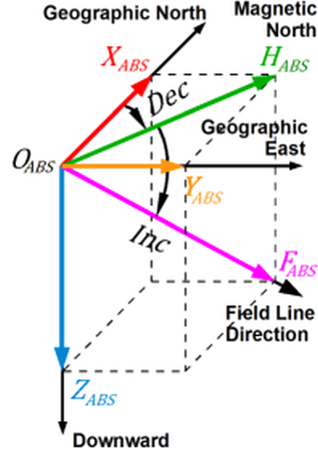  
**Figura 1.** Elementi campo geomagnetico

Considerando un punto _OABS_ (*ABS*, i.e. riferimento assoluto) sulla superfice terrestre, il vettore induzione magnetica 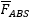 per esso passante, qualunque esso sia, si può scomporre come somma vettoriale di altri tre:  
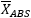 diretto lungo il meridiano geografico, verso Nord positivo;  
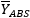 diretto lungo il parallelo geografico, verso Est positivo;  
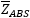 diretto lungo la verticale, verso il basso positivo.  

Ne risulta la relazione: 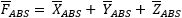 mentre 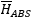 è la proiezione di  sul piano orizzontale e quindi sussistono anche le seguenti espressioni:
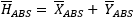 e 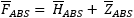.

Inoltre definiamo: 
 angolo declinazione, è l'angolo tra nord geografico e nord magnetico; positivo se  è diretto verso Est.  
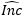 angolo inclinazione, è l'angolo tra il piano orizzontale e il vettore ; positivo se  è diretto verso il basso.  
,  e  formano una terna ortogonale di vettori orientata secondo il riferimento geografico più direzione verticale al suolo.  

## 1.1 Procedura abituale per ottenere componenti geomagnetiche continue
Le componenti assolute _XABS, YABS, ZABS_ rivestono il ruolo fondamentale di misure di riferimento.
Il *FGM* fornisce misurazioni continue del campo geomagnetico sempre in *set* di tre grandezze vettoriali similmente al riferimento geografico, però in un diverso riferimento pseudo-casuale detto variometrico (in seguito: *VAR*, *variometric reference*).  
Per ricondurre le misurazioni continue eseguite nel riferimento *VAR* in corrispondenti valori continui e virtuali ma nel riferimento *ABS*, le differenze omologhe *ABS*-*VAR* (i.e. linee di basi) vengono calcolate ai tempi delle misurazioni assolute.  
Queste differenze discrete vengono interpolate lungo l'intervallo temporale opportuno e tramite inversione matematica, i valori *ABS* virtuali sono calcolati per tutti i tempi delle letture continue nel riferimento *VAR*, per ciascuna delle tre componenti *XYZ*.  

## 1.2 Misure assolute discrete
La conoscenza delle componenti assolute geomagnetiche ,  e  si ottiene generalmente misurando gli angoli  e  magnetici e conoscendo il valore 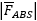 ai tempi corrispondenti.  
Queste misure sono manuali e quindi discrete.  

Gli angoli magnetici  e  si trovano ruotando, mediante un teodolite smagnetizzato, lungo i cerchi orizzontale e verticale, un rivelatore vettoriale di campo magnetico alla ricerca delle posizioni in cui si trova un valore del campo nullo, (strumento chiamato *DIM*, i.e. *Declination Inclination Magnetometer*), \[[Jankowski and Sucksdorff, 1996](#bIAGA)\].     

Il menzionato valore  è ottenuto dalla misurazione di un magnetometro scalare, solitamente un magnetometro a precessione di protoni o magnetometro ad effetto **Overhauser** (in seguito: *SM scalar magnetometer*), permanentemente in acquisizione.  

Se occorre, il modulo di  dovrebbe essere variato matematicamente tramite una costante periodicamente verificata, che tenga conto dei gradienti magnetici tra i vari punti dell\'osservatorio in cui si trovano gli strumenti di misura, vedi [Figura 2](#Fig2) successiva.  

## 1.3 Note sulle caratteristiche costruttive dei magnetometri *flux-gate*
Qui vengono presi in considerazione solo due aspetti dello strumento *VAR* impiegato; in base a queste diverse caratteristiche, cambiano le procedure matematiche adottate.  

## 1.3.1 Meccanica del sistema di sensori
I *FGM* possiedono delle terne sensori geomagnetici con caratteristiche costruttive di due tipi principali:  
terna fissa costituita da sensori *X*,*Y*,*Z* mutuamente ortogonali  
e  
terna composta da sensori disposti su giunto cardanico: la direzione del sensore *Z* è sempre verticale per gravità mentre i sensori *X* e *Y*, ortogonali tra loro, sono posizionati in un piano normale rispetto alla direzione *Z*.  

## 1.3.2 *Dynamic range* dei sensori
I *FGM* di prima generazione avevano una *dynamic range* limitata, infatti ciascun sensore lavorava artificialmente in un campo magnetico circa nullo perché altrimenti il valore induzione magnetica presente avrebbe facilmente saturato il sensore stesso.  
In tal caso i sensori *flux-gate* misuravano praticamente delle variazioni, da addizionare alle porzioni principali di componente magnetica.  
Ciascun nucleo del sensore, quindi, era dotato di compensazione elettromagnetica.  
Caratteristiche *FGM* di alcuni *IMO*; (i.e. *Intermagnet Magnetic Observatory*).  
DYNAMIC RANGE:  +/- 5000 nT (EBR, esp)  
DYNAMIC RANGE:   +/- 500 nT (SPT, esp)  
DYNAMIC RANGE:      6500 nT (LZH, chn)  
\[[INTERMAGNET organization, 2014](#bIntermagnetDVD2010)\].  

I *FGM* di generazione più evoluta, sono progettati con *dynamic range* tanto ampia da superare il valore induzione campo magnetico misurabile sulla superfice terrestre.  
In questa circostanza, le compensazioni elettroniche artificiali dei tre nuclei dei sensori sono inutili:  
DYNAMIC RANGE:   Full field (all can)  
DYNAMIC RANGE: +/- 80000 nT (all usa)  
DYNAMIC RANGE: +/- 70000 nT (CLF, fra)  
\[[INTERMAGNET organization, 2014](#bIntermagnetDVD2010)\].  

Nel seguito, faremo riferimento a strumenti *VAR* aventi basso valore della *dynamic range*, che richiedono quindi una compensazione elettronica.  
Il trattamento della tipologia di strumenti *VAR* con una *dynamic range* sufficientemente elevata è più semplice, potenzialmente più preciso e non richiede modifiche formali alle procedure.  
Vedi prossimi [§§3](#p3), [§§4](#p4).  

## 1.4 Intermezzo comune alle due tipologie di terna sensore
Tenendo conto delle differenze descritte nei precedenti [§1.3.1](#p1_3_1) e [§1.3.2](#p1_3_2), fondamentalmente, le risoluzioni possono essere implementate attraverso la variazione delle coordinate magnetiche tra il riferimento *VAR* (variometrico e noto) di partenza e il riferimento *ABS* (assoluto e incognito) di arrivo, per le componenti *XYZ* omologhe.
   Le soluzioni per terna dotata di sensori fissi e per terna dotata di sensori posizionati su articolazione cardanica saranno discusse, rispettivamente, nei [§§3](#p3) e [§§4](#p4).
  Il [§5](#p5) presenterà le soluzioni matematiche complete per i due sistemi.
  I [§§6](#p6) argomenteranno delle convenzioni temporali proposte per la risoluzione dei due tipi di sensori.
  Infine l'ultimo [§7](#p7), confronterà la metodologia descritta con la procedura tradizionale fondata sulla valutazione dei singoli valori baseline.

## 2. *Flowchart* essenziale del trattamento dati in un osservatorio geomagnetico
Il diagramma evidenzia i diversi siti in cui sono posizionati i vari strumenti, posti a distanza sufficiente da non influenzare a vicenda le misure rilevate.

  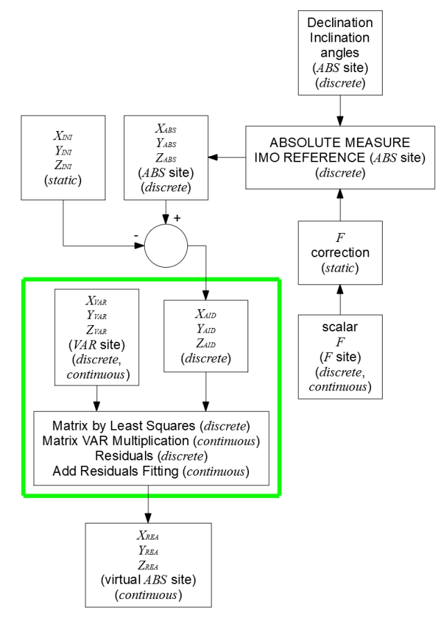  
**Figura 2.** *Flowchart* elaborazione dati geomagnetici

Il termine ***static*** indica valori numerici che, sotto determinate condizioni, si possono assumere costanti.  
La dicitura ***discrete*** segnala dati discreti.  
La dicitura ***continuous*** indica dati continui.  
Il riquadro verde delimita il nucleo delle procedure particolari.

## 3. Sensori variometrici su terna fissa, approccio al problema
Ricordando la [Figura 1](#Fig1), consideriamo:  
-numero _N_ terne ordinate (_XABS,YABS,ZABS_) composte da valori di induzione magnetica delle misurazioni assolute discrete ottenute tramite *DIM*: questo sistema di riferimento ha origine in _OABS_.

Definiamo due punti magnetici:  
_OVAR_ è l\'origine della terna variometrica delle misurazioni magnetiche continue eseguite tramite *FGM*,  
_OREA_ è l\'origine della terna delle misurazioni magnetiche virtuali continue che si calcolano attraverso la procedura corrente.

La [Figura 3](#Fig3) mostra la situazione descritta:

  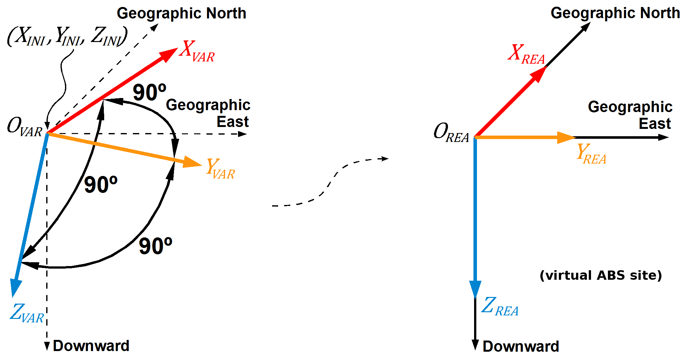  
**Figura 3.** Componenti geomagnetiche lette dal variometro *FGM* nel suo riferimento _OVAR_ (a sinistra), e passaggio alle componenti reali nel riferimento _OREA_ (a destra)

L'origine di arrivo è denominata _OREA_, ma le componenti _XREA, YREA, ZREA_ calcolate alla fine attraverso la trasformazione sono virtuali e si riferiscono all'origine _OABS_, che è il riferimento osservatorio.  
Perciò, virtualmente, _OREA_ coincide con _OABS_.  

Consideriamo anche:  
-terne ordinate (_XVAR,YVAR,ZVAR_) campionate a intervalli regolari da un *set* di tre sensori *flux-gate* mutuamente ortogonali con orientamento incognito.  
Il *set* di sensori è posato nel punto _OVAR_; quest'ultimo è distinto dal punto _OABS_.  

-terna ordinata (_XINI,YINI,ZINI_).  
Due casi devono essere distinti in base alla caratteristica del *dynamic range* dello strumento *VAR* utilizzato, vedi [§1.3.2](#p1_3_2).  

Alta *dynamic range*.  
In questo caso, è sufficiente annullare la terna ordinata in questione:
  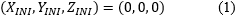  
in tutte le formule successive coinvolte.

Bassa *dynamic range*.  
A causa della modalità di calcolo che sarà esposta a partire dal paragrafo successivo, è necessario stimare i valori delle componenti *X*,*Y*,*Z* assolute nel punto _OVAR_ nel momento in cui avviene l'orientamento del *set* sensori.  
Questi valori possono essere stimati abbastanza agevolmente attraverso l\'esecuzione di una misura assoluta simultanea, infatti risulta:
  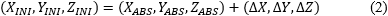  

dove:  
_XABS,YABS,ZABS_ sono i valori ottenuti dal calcolo misura assoluta,
  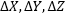 rappresentano i gradienti di induzione magnetica tra i siti *ABS* (i.e. *DIM*) e *VAR* (i.e. *FGM*) per le tre componenti.  
I gradienti  sono delle quantità quasi costanti, almeno sul breve periodo, ed è buona norma controllarli periodicamente. Indubbiamente più stabili e piccole rimangono queste quantità nel tempo e migliore è la qualità dell\'osservatorio geomagnetico.  

Infine, allo stesso tempo, è necessario annullare elettronicamente (_XVAR,YVAR,ZVAR_) sullo strumento *VAR*, preferibilmente in sincronia con il misuratore sul *DIM*.  

Una volta impostato il sensore, se ci sono compensazioni (i.e. strumento con bassa *dynamic range*), le stesse regolazioni non devono più essere modificate.  

## 3.1 Calcolo della matrice di rotazione del sensore applicando il metodo dei minimi quadrati
In questa prima fase, consideriamo il sottoinsieme di _N_ terne ordinate (_XVAR,YVAR,ZVAR_) che corrisponde ai tempi delle _N_ misure assolute discrete (_XABS,YABS,ZABS_).  

Con il contributo della terna ordinata costante (_XINI,YINI,ZINI_), possiamo considerare la solita espressione matematica che lega due riferimenti magnetici tridimensionali ortogonali generici:
  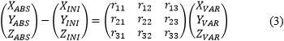  

dove r11,r12,r13,r21,r22,r23,r31,r32,r33 sono i nove elementi della matrice di rotazione _R3x3_; essi correlano i valori letti sul sito *VAR* con i valori reali presenti sul sito *ABS* (o *DIM*).  
Per il calcolo di questa matrice _R3x3_ prendiamo in considerazione solo le misure assolute e letture variometro (pedice *VAR*), ad istanti discreti corrispondenti.  
Tale matrice viene calcolata con il contributo dei segnali totali del *FGM* e, pertanto, tiene conto anche delle cause indesiderate che possono influenzare le misurazioni a lungo termine: derive di temperatura, derive elettroniche e persino livellamento meccanico del *set* di sensori dello strumento *VAR*.  
Svolgendo si ha:
  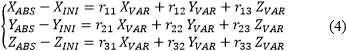  

ai primi membri delle tre espressioni, si possono effettuare le seguenti sostituzioni:  
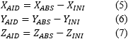  
pedice *AID* (i.e. *Abs Ini Difference*)

e il sistema diventa:
  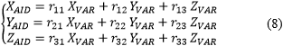  

Le tre equazioni che costituiscono (8) possono essere separate perché i valori numerici *AID* e *VAR* sono noti e imposti da prelievi o calcolo dati.  
Si consideri solo la prima equazione inclusa in (8):  
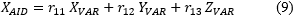  
ed esaminiamo gli _N_ valori sperimentali delle quantità riportate.

I valori di r11,r12,r13 che meglio approssimano gli _N_ valori sperimentali di _XAID_, _XVAR_, _YVAR_, _ZVAR_ legati dalla relazione (9) nel senso dei minimi quadrati, si ottengono nel modo usuale costruendo lo scarto:
  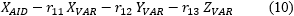  

ed elevandolo al quadrato:
  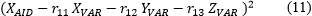  

L'evoluzione _E_ del quadrato dello scarto, per gli _N_ campioni di _XAID_, _XVAR_, _YVAR_, _ZVAR_ risulta:
  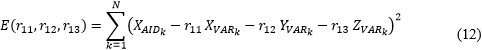  

Il punto di minimo di _E(r11,r12,r13)_ può essere calcolato imponendo il simultaneo annullamento delle derivate parziali di _E_ nelle variabili r11,r12,r13:
  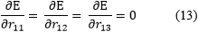  

La soddisfazione di questa condizione porta alla risoluzione di un sistema lineare di rango 3 in cui le incognite sono r11,r12,r13.  

I riga sistema:
  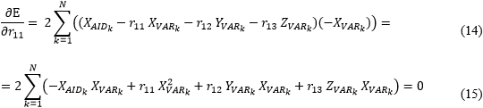  

i.e.
    

II riga sistema:
  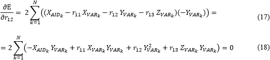  

i.e.
  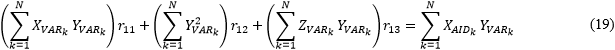  

III riga sistema:
  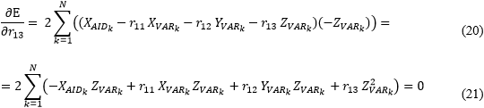  

i.e.
  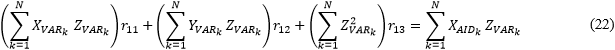  

I sei elementi rimanenti r21,r22,r23 e r31,r32,r33 della matrice di rotazione sono ottenuti da due procedure analoghe applicando le opportune serie di dati sperimentali alle equazioni:
  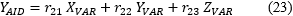  
e
  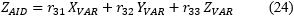  
del sistema [\(8\)](#eq8).

## 3.2 Stima dei residui tra i valori sperimentali _XAID_,_YAID_,_ZAID_ e i valori _XVAR_,_YVAR_,_ZVAR_ ruotati tramite matrice del sensore
Le informazioni ottenute attraverso il calcolo della matrice di rotazione _R3x3_, saranno successivamente integrate utilizzando i residuali tra i valori assoluti sperimentali (_XAID,YAID,ZAID_) e i valori (_XVAR,YVAR,ZVAR_) rilevati dal variometro e successivamente ruotati, ai tempi delle misure assolute eseguite.  
Questi residuali discreti, per ciascuno degli _N_ punti, sono calcolati come segue:  
  
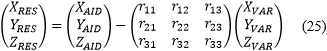  

## 3.3 Stima delle interpolazioni dei residui e loro aggiunta ai valori _XVAR_,_YVAR_,_ZVAR_ ruotati tramite matrice del sensore
Interpolando queste _N_ triple ordinate di residuali discreti (_XRES,YRES,ZRES_) calcolate dalla (25) con le loro adatte variabili indipendenti tempo, per l\'intero intervallo di tempo interessato, otteniamo le terne ordinate continue (_XFitRES,YFitRES,ZFitRES_) che forniscono le correzioni ottimali da addizionare al contributo dei valori continui (_XVAR,YVAR,ZVAR_) moltiplicato per la matrice di rotazione del sensore:  
  
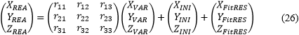  

I valori reali (_XREA,YREA,ZREA_) calcolati sono relativi al sito *ABS* (o *DIM*), ma ottenuti fisicamente dai corrispondenti valori numerici (_XVAR,YVAR,ZVAR_) registrati continuamente dallo strumento *flux-gate* *VAR* con orientamento casuale.

A causa dell\'esecuzione di misurazioni assolute tramite *DIM* e delle tecniche matematiche adottate, l\'implementazione pratica dei metodi esposti richiede considerazioni sui tempi sia delle misurazioni assolute eseguite *XYZF* *AID* che dei dati considerati *XYZF* *VAR*: una di queste possibilità sarà presentata negli ultimi [§§6](#p6).  
Fino alla discussione di questi paragrafi, le procedure sviluppate non terranno conto di tempi precisi.

## 4. Sensori variometrici disposti su sospensione cardanica, approccio al problema
Ricordando la [Figura 1](#Fig1), consideriamo:  
-numero _N_ coppie ordinate (_XABS,YABS_) e quantità _ZABS_ composte da valori di induzione magnetica delle misurazioni assolute discrete ottenute tramite *DIM*: questo sistema di riferimento ha origine in _OABS_.

Definiamo due punti magnetici:  
_OVAR_ è l\'origine della terna variometrica delle misurazioni magnetiche continue eseguite tramite *FGM*,  
_OREA_ è l\'origine della terna delle misurazioni magnetiche virtuali continue che vengono calcolate attraverso la procedura corrente.

La [Figura 4](#Fig4) mostra la situazione descritta:

  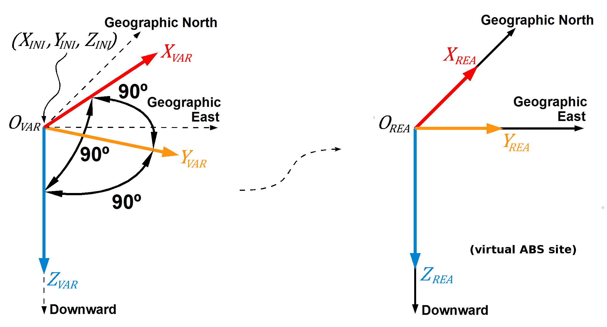  
**Figura 4.** Componenti geomagnetiche lette dal variometro *FGM* nel suo riferimento _OVAR_ (a sinistra), e passaggio alle componenti reali nel riferimento _OREA_ (a destra)

L'origine di arrivo è denominata _OREA_, ma le componenti _XREA, YREA, ZREA_ calcolate alla fine attraverso la trasformazione sono virtuali e si riferiscono all'origine _OABS_, che è il riferimento osservatorio.  
Perciò, virtualmente, _OREA_ coincide con _OABS_.  

Consideriamo anche:  
-coppie ordinate (_XVAR,YVAR_) e quantità _ZVAR_ campionate a intervalli regolari da un *set* di tre sensori vettoriali *flux-gate* disposti su di una articolazione cardanica.  
Il *set* di sensori è posato nel punto _OVAR_; quest'ultimo è distinto dal punto  _OABS_.  

La terna dei sensori che misura (_XVAR,YVAR_) e _ZVAR_ è sospesa e la verticale lungo la direzione della forza peso e la direzione sensibile della componente _ZVAR_ coincidono, quindi _ZVAR_ misura davvero una quantità proporzionale alla componente verticale reale _ZREA_.  
Sulla base della costruzione meccanica del *set* sensori, le altre due direzioni sensibili _XVAR_ e _YVAR_ della terna *flux-gate* sono ortogonali tra loro ed entrambe ortogonali alla direzione sensibile della componente _ZVAR_.  
Sebbene la direzione sensibile della componente _ZVAR_ sia sempre verticale, il piano orizzontale può ruotare attorno all'asse verticale e pertanto le direzioni delle componenti _XVAR_ e _YVAR_ non sono immutabili.  

-terna ordinata (_XINI,YINI,ZINI_).  
Due casi devono essere distinti in base alla caratteristica del *dynamic range* dello strumento *VAR* utilizzato, vedi [§1.3.2](#p1_3_2).  

Alta *dynamic range*.  
In questo caso, è sufficiente annullare la terna ordinata in questione:
  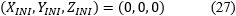  
in tutte le formule successive coinvolte.

Bassa *dynamic range*.  
A causa della modalità di calcolo che sarà esposta a partire dal paragrafo successivo, è necessario stimare i valori delle componenti *X*,*Y*,*Z* assolute nel punto _OVAR_ nel momento in cui avviene l'orientamento del *set* sensori.  
Questi valori possono essere stimati abbastanza agevolmente attraverso l\'esecuzione di una misura assoluta simultanea, infatti risulta:
  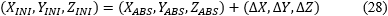  

dove:  
_XABS,YABS,ZABS_ sono i valori ottenuti dal calcolo misura assoluta,
   rappresentano i gradienti di induzione magnetica tra i siti *ABS* (i.e. *DIM*) e *VAR* (i.e. *FGM*) per le tre componenti.  
I gradienti  sono delle quantità quasi costanti, almeno sul breve periodo, ed è buona norma controllarli periodicamente. Indubbiamente più stabili e piccole rimangono queste quantità nel tempo e migliore è la qualità dell\'osservatorio geomagnetico.  

Infine, allo stesso tempo, è necessario annullare elettronicamente (_XVAR,YVAR,ZVAR_) sullo strumento *VAR*, preferibilmente in sincronia con il misuratore sul *DIM*.  

Una volta impostato il sensore, se ci sono compensazioni (i.e. strumento con bassa *dynamic range*), le stesse regolazioni non devono più essere modificate.  

La presenza della articolazione cardanica consente di separare le elaborazioni per le coppie ordinate (_XVAR,YVAR_), vedi [§4.1](#p4_1), [§4.2](#p4_2) e [§4.3](#p4_3); dalle elaborazioni relative alle componenti _ZVAR_, vedi [§4.4](#p4_4).  

## 4.1 Calcolo della matrice di rotazione per le componenti _XVAR_ e _YVAR_ ortogonali tra loro e giacenti nel piano orizzontale, applicando il metodo dei minimi quadrati
A differenza del sensore a terna fissa, l\'elaborazione per _XAID_, _YAID_, _XVAR_, _YVAR_ è totalmente separata da quella relativa a _ZAID_, _ZVAR_.   
In questa prima fase, consideriamo il sottoinsieme di _N_ coppie ordinate (_XVAR,YVAR_) che corrisponde ai tempi delle _N_ misure assolute discrete  (_XABS,YABS_).  

Con il contributo della coppia ordinata costante (_XINI,YINI_), possiamo considerare la solita espressione matematica che lega due riferimenti magnetici bidimensionali ortogonali generici:
  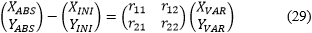  

dove r11,r12,r21,r22 sono i quattro elementi della matrice di rotazione _R2x2_; essi correlano i valori letti sul sito *VAR* con i valori reali presenti sul sito *ABS* (o *DIM*).  
Per il calcolo di questa matrice _R2x2_ prendiamo in considerazione solo le misure assolute e letture variometro (pedice *VAR*), ad istanti discreti corrispondenti.  
Tale matrice viene calcolata con il contributo dei segnali totali del *FGM* e, pertanto, tiene conto anche delle cause indesiderate che possono influenzare le misurazioni a lungo termine: derive di temperatura, derive elettroniche e persino livellamento meccanico del *set* di sensori dello strumento *VAR*.  
Svolgendo si ha:
  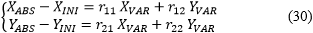  

ai primi membri delle due espressioni, è possibile effettuare le seguenti sostituzioni:  
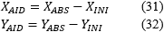  
pedice *AID* (i.e. *Abs Ini Difference*)

e il sistema diventa:
  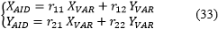  

Le due equazioni che costituiscono (33) possono essere separate perché i valori numerici *AID* e *VAR* sono noti e imposti da prelievi o calcolo dati.  
Si consideri solo la prima equazione inclusa in (33):  
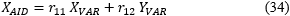  
ed esaminiamo gli _N_ valori sperimentali delle quantità riportate.

I valori di r11,r12 che meglio approssimano gli _N_ valori sperimentali di _XAID_, _XVAR_, _YVAR_ legati dalla relazione (34) nel senso dei minimi quadrati, si ottengono nel modo usuale costruendo lo scarto:
  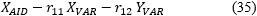  

ed elevandolo al quadrato:
  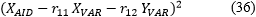  

L'evoluzione _E_ del quadrato dello scarto, per gli _N_ campioni di _XAID_, _XVAR_, _YVAR_ risulta:
  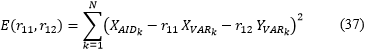  

Il punto di minimo di _E(r11,r12)_ può essere calcolato imponendo l'annullamento simultaneo delle derivate parziali di _E_ nelle variabili r11,r12:
  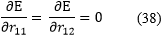  

La soddisfazione di questa condizione porta alla risoluzione di un sistema lineare di rango 2 in cui le incognite sono r11,r12.  

I riga sistema:
  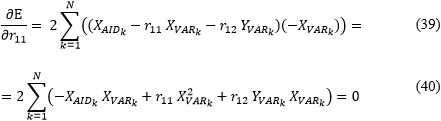  

i.e.
  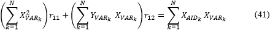  

II riga sistema:
  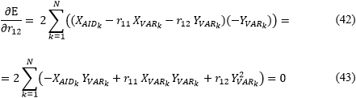  

i.e.
  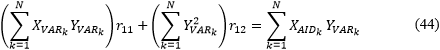  

I due elementi rimanenti r21,r22 della matrice di rotazione sono ottenuti mediante procedura analoga applicando le opportune serie di dati sperimentali alla equazione:
    
del sistema [\(33\)](#eq33).

## 4.2 Stima dei residui tra i valori sperimentali _XAID_,_YAID_ e i valori _XVAR_,_YVAR_ ruotati tramite matrice del sensore
Le informazioni ottenute attraverso il calcolo della matrice di rotazione _R2x2_, saranno successivamente integrate utilizzando i residuali tra i valori assoluti sperimentali (_XAID_,_YAID_) e i valori (_XVAR_,_YVAR_) rilevati dal variometro e successivamente ruotati, ai tempi delle misure assolute eseguite.  
Questi residuali discreti, per ciascuno degli _N_ punti, sono calcolati come segue:  
  
  

## 4.3 Stima delle interpolazioni dei residui e loro aggiunta ai valori _XVAR_,_YVAR_ ruotati tramite matrice del sensore
Interpolando queste _N_ coppie ordinate di residuali discreti (_XRES,YRES_) calcolate dalla (46) con le loro adatte variabili indipendenti tempo, per l'intero intervallo di tempo interessato, otteniamo le coppie ordinate continue (_XFitRES,YFitRES_) che forniscono le correzioni ottimali da addizionare al contributo dei valori continui (_XVAR,YVAR_) moltiplicati per la matrice di rotazione del sensore:  
  
  

I valori reali (_XREA,YREA_) calcolati sono relativi al sito *ABS* (o *DIM*), ma ottenuti fisicamente dai corrispondenti valori numerici (_XVAR,YVAR_) registrati continuamente dallo strumento *flux-gate* *VAR* con orientamento casuale.

A causa dell'esecuzione di misurazioni assolute tramite *DIM* e delle tecniche matematiche adottate, l'implementazione pratica dei metodi esposti richiede considerazioni sui tempi sia delle misurazioni assolute eseguite *XYZF* *AID* che dei dati considerati *XYZF* *VAR*: una di queste possibilità sarà presentata negli ultimi [§§6](#p6).  
Fino alla discussione di questi paragrafi, le procedure sviluppate non terranno conto di tempi precisi.

## 4.4 Calcolo valori _ZREA_ continui
L'elemento sensibile della componente vettoriale _ZVAR_ assume sempre un orientamento verticale dovuto alla costruzione meccanica della terna sensore, quindi per ogni valore del campionamento continuo _ZVAR_ discende immediatamente il corrispondente valore continuo:
    

Dove i valori continui _ZFitBAS_ sono ottenuti preventivamente dall'interpolazione dei termini *baseline* _ZBAS_ delle misure assolute discrete e calcolati singolarmente come:
    

Nella costruzione della serie continua _ZFitBAS_, è stato scelto di ripetere l'unico valore _ZBAS_ calcolato per ogni singolo minuto relativo alla misura di inclinazione.  
Queste interpolazioni hanno variabili indipendenti rappresentate dai tempi adeguati della misura di inclinazione.  

Invece, per valutare il valore discreto della (49), _ZABS_ (i.e. _ZAID_) è l'unico valore calcolato, mentre _ZVAR_ si ottiene calcolando la media tra tutti i valori di _ZVAR_ rilevati ai tempi inclinazione della misura assoluta considerata.

## 5. Sistemi lineari risultanti
I sistemi lineari per il calcolo delle matrici di rotazione, per entrambe le tipologie di sensore *VAR*, sono riportati per completezza di seguito:

sensori su terna fissa:
  
  

    

  
  

sensori su *gimbal*:
  
  

  
  

Come possiamo verificare, nei sistemi lineari di ordine 3 (o 2), le matrici incomplete rimangono inalterate, invece le matrici dei termini noti variano, in dipendenza delle righe della matrice di rotazione da calcolare.

## 6. Note importanti sui tempi
Il seguente diagramma focalizza i tempi di una tipica misura assoluta \(dalla [Figura 1](#Fig1)\):

    
**Figura 5.** Tempi di esecuzione misura *DIM*  
  \[[Jankowski and Sucksdorff, 1996](#bIAGA)\].  
Per una corretta applicazione delle metodologie, per ogni misura assoluta, devono essere presenti tutte le componenti:
  Entrambe le triple ordinate (_XAID,YAID,ZAID_) e (_XVAR,YVAR,ZVAR_), per sensori su terna fissa.
  Entrambe le coppie ordinate (_XAID,YAID_) e (_XVAR,YVAR_), per terna dotata di sospensione basculante.
 Questo può essere verificato osservando i dati disponibili.

Ciascuna misura assoluta considerata dovrebbe essere eseguita in un istante; questo di solito non accade, infatti per una misura assoluta, le letture di declinazione e di inclinazione possono richiedere più minuti.  
Seguono alcune proposte per implementare il tempo nelle procedure.

## 6.1 Tempi per sensori disposti su terna fissa

## 6.1.1 Calcolo matrice del sensore - vedi [\(50\)](#eq50), [\(51\)](#eq51), [\(52\)](#eq52) e residuali _XRES_, _YRES_, _ZRES_ - vedi [\(25\)](#eq25)
Nel calcolo di questi elementi prendono parte le _N_ terne ordinate (_XAID,YAID,ZAID_) e (_XVAR,YVAR,ZVAR_), considerate ai tempi delle misure assolute discrete.  
Sia la matrice di rotazione _R3x3_ che le terne discrete ordinate (_XRES,YRES,ZRES_) ottenute, derivano dal calcolo minimi quadrati e non riguardano tempi specifici.  

I valori che compongono (_XAID,YAID,ZAID_), come visto in precedente [Figura 5](#Fig5), sono certamente misurati in intervalli di tempo non trascurabili ma, considerando che nel calcolo dei minimi quadrati i valori del tempo sono irrilevanti, assumiamo semplicemente ogni misura assoluta come unica entità. 

I valori (_XVAR,YVAR,ZVAR_), invece, possono essere scelti tra tutti quelli misurati con continuità dallo strumento *VAR*, ai tempi coinvolti nella misura assoluta e precisamente: 
Calcolo della media tra tutti i valori _XVAR_ (o _YVAR_) acquisiti nei tempi della misura di declinazione, insieme a quelli acquisiti nei tempi della misura inclinazione.  
Calcolo della media tra tutti i valori _ZVAR_ acquisiti nei tempi di misura inclinazione.  

## 6.1.2 Interpolazione delle serie discrete _XRES_, _YRES_, _ZRES_ onde stimare le serie continue _XFitRES_, _YFitRES_, _ZFitRES_ - vedi [\(26\)](#eq26)
Le _N_ terne ordinate discrete (_XRES,YRES,ZRES_), prendono parte al calcolo di queste interpolazioni, con variabili indipendenti i tempi delle misure assolute.  
Come riportato nel precedente [§6.1.1](#p6_1_1), anche le terne ordinate (_XRES,YRES,ZRES_) sono considerate come entità dipendenti dalla misura assoluta determinata, ma senza tempo associato.  

Le terne ordinate continue (_XFitRES,YFitRES,ZFitRES_) sono ottenute interpolando, tramite il metodo scelto, le terne ordinate discrete (_XRES,YRES,ZRES_) considerando gli intervalli di tempo appropriati.  
A tal fine, tempi specifici sono stati reintrodotti coerentemente con i percorsi logici esposti nella [Figura 5](#Fig5):  
Per calcolare la serie _XFitRES_ (o _YFitRES_), i valori _XRES_ (o _YRES_) sono stati interpolati con variabili indipendenti i tempi di declinazione uniti ai tempi di inclinazione, della particolare misura assoluta.  
Per calcolare la serie _ZFitRES_, i valori _ZRES_ sono stati interpolati con variabili indipendenti i tempi inclinazione della particolare misura assoluta.  

Inoltre:  
Lo stesso valore di _XRES_ (o _YRES_) associato alla misura assoluta considerata, è stato ripetuto per ogni singolo minuto che costituisce l\'intervallo di tempo della declinazione e della inclinazione.  
Con politica analoga, il valore di _ZRES_ associato alla misura assoluta considerata, è stato ripetuto per ogni singolo minuto che costituisce l\'intervallo di tempo della inclinazione.

## 6.2 Tempi per sensori disposti su sospensione cardanica

## 6.2.1 Calcolo matrice del sensore - vedi [\(53\)](#eq53), [\(54\)](#eq54) e calcolo residuali _XRES_, _YRES_ - vedi [\(46\)](#eq46)
Nel calcolo di questi elementi prendono parte le _N_ coppie ordinate (_XAID,YAID_) e (_XVAR,YVAR_), considerate ai tempi delle misure assolute discrete.
  Sia la matrice di rotazione _R2x2_ che le coppie discrete ordinate (_XRES,YRES_) ottenute, derivano dal calcolo minimi quadrati e non riguardano tempi specifici.

I valori che compongono (_XAID,YAID_), come visto in precedente [Figura 5](#Fig5), sono certamente misurati in intervalli di tempo non trascurabili ma, considerando che nel calcolo dei minimi quadrati i valori del tempo sono irrilevanti, assumiamo semplicemente ogni misura assoluta come unica entità.

I valori (_XVAR,YVAR_), invece, possono essere scelti tra tutti quelli misurati con continuità dallo strumento *VAR*, ai tempi coinvolti nella misura assoluta e precisamente:  
Calcolo della media tra tutti i valori _XVAR_ (o _YVAR_) acquisiti nei tempi della misura di declinazione, insieme a quelli acquisiti nei tempi di misura inclinazione.

## 6.2.2 Interpolazione delle serie discrete _XRES_, _YRES_ onde stimare le serie continue _XFitRES_, _YFitRES_ - vedi [\(47\)](#eq47)
Le _N_ coppie ordinate discrete (_XRES,YRES_) prendono parte al calcolo di queste interpolazioni, con variabili indipendenti i tempi delle misure assolute.  
Come riportato nel precedente [§6.2.1](#p6_2_1), anche le coppie ordinate (_XRES,YRES_) sono considerate come entità dipendenti dalla misura assoluta determinata, ma senza tempo associato.  

Le coppie ordinate continue (_XFitRES,YFitRES_) sono ottenute interpolando, tramite il metodo scelto, le coppie ordinate discrete (_XRES,YRES_) considerando gli intervalli di tempo appropriati.  
A tal fine, tempi specifici sono stati reintrodotti coerentemente con i percorsi logici esposti nella [Figura 5](#Fig5):  
Per calcolare la serie _XFitRES_ (o _YFitRES_), i valori _XRES_ (o _YRES_) sono stati interpolati con variabili indipendenti i tempi di declinazione uniti ai tempi di inclinazione, della particolare misura assoluta.  

Inoltre:  
Lo stesso valore di _XRES_ (o _YRES_) associato alla misura assoluta considerata, è stato ripetuto per ogni singolo minuto che costituisce l\'intervallo di tempo della declinazione e della inclinazione.

## 7. Conclusioni
Tali metodologie di conversione possono essere usate indifferentemente per terne sensori *FGM* posate sia con orientamento *HDZ* che *XYZ* \[[Technical University of Denmark, 2014](#bDTU_Orie)\] anzi, per quanto discusso, teoricamente l'orientamento del sistema di sensori può essere casuale.  

Logicamente, è utile posizionare regolarmente il *set* di sensori nell\'orientamento *HDZ* o *XYZ* e quindi combinare entrambe le procedure:  
-Inizialmente quella con formule di riduzione tradizionali e calcolo di singoli valori base per una verifica preliminare delle linee di base: controllo generale dell\'acquisizione, derive elettroniche e di temperatura o per costruire dati provvisori \[[Rigler, 2015](#bUSGS_Red); [DANISH METEOROLOGICAL INSTITUTE, TECHNICAL REPORT 04-14, 2004](#bDMI_Red)\].  
-In seguito, quando saranno disponibili tutte le serie di dati, sarà conveniente applicare le tecniche descritte con l\'uso di minimi quadrati e residui. Questa operazione compensa anche il livellamento del terreno e vengono costruiti i dati definitivi.  

In presenza di spostamenti noti o casuali dovuti a terremoti che interessano la terna sensore, è ovviamente consigliabile eseguire misure assolute quanto prima possibile dopo l'evento che ha modificato la posizione del sistema sensori.  
Se risulta conveniente, le serie di dati possono essere opportunamente divise per aumentare l\'accuratezza dei risultati parziali.  
In presenza di *FGM* aventi bassi valori di *dynamic range*, in genere non è necessario procedere con una nuova acquisizione di valori iniziali (_XINI,YINI,ZINI_).  
Infatti, anche se la posizione della terna sensore è cambiata formalmente, se il sito di posa possiede basso gradiente magnetico, le condizioni iniziali risultano pressoché inalterate: l'accorgimento necessario rimane quello di non modificare le regolazioni elettroniche iniziali.  

Utilizzando le formule di riduzione tradizionali, vedi [§1.1](#p1_1), viene eseguita una singola interpolazione numerica sui valori *baseline* (per ciascuna componente magnetica); mentre con il metodo esposto se ne eseguono due:  
-la prima calcola la matrice fissa di rotazione: vedi [§3.1](#p3_1) per _R3x3_ o  [§4.1](#p4_1) per _R2x2_.  
-la seconda calcola l\'interpolazione dei residui per compensare i valori prodotti dalla rotazione effettuata tramite matrice fissa del sensore: vedi [§3.3](#p3_3) per _R3x3_ o [§4.3](#p4_3) per _R2x2_.  

Evidentemente, questo porta a un incremento dell’errore computazionale. Per contro, queste procedure sono particolarmente indicate per sensori *FGM* installati in luoghi caratterizzati da una certa sismicità o soggetti a variazioni naturali lente e apprezzabili del livello del suolo perché sono basate sui valori reali “veri”.
  Per esempio, permettono di minimizzare le conseguenze di uno spostamento *random* del *set* sensori a cavallo di un evento sismico importante.

## Ringraziamenti
I risultati presentati in questo documento si basano sui dati raccolti presso osservatori magnetici. Ringraziamo gli istituti nazionali che li supportano e INTERMAGNET per la promozione di elevati standard di pratica dell\'osservatorio magnetico ([www.intermagnet.org](http://www.intermagnet.org)).

## Bibliografia

DANISH METEOROLOGICAL INSTITUTE, TECHNICAL REPORT 04-14, (2004). *Magnetic Results 2003 Brorfelde, Qeqertarsuaq, Qaanaaq and Narsarsuaq Observatories.* DANISH METEOROLOGICAL INSTITUTE, Copenhagen, pp. 5.  
web page: <https://www.intermagnet.org/yearbooks/Denmark_2003.pdf>

Hitchman A.P., Crosthwaite P.G., Jones W.V., Lewis A.M., Wang L., (2011). *Australian Geomagnetism Report 2010, Volume 58*. Geoscience Australia, pp. 3.  
web page: <https://www.intermagnet.org/yearbooks/Australia_2010.pdf>

INTERMAGNET organization, (2012). *INTERMAGNET Technical Reference Manual Version 4.6.*  
web page: <https://www.intermagnet.org/publications/intermag_4-6.pdf>

INTERMAGNET organization, (2014). *MAGNETIC OBSERVATORY DEFINITE DATA, INTERMAGNET 2010,* Observatory Information, DVD ROM.

Jankowski J. and Sucksdorff C., (1996). *GUIDE FOR MAGNETIC MEASUREMENTS AND OBSERVATORY PRACTICE*. IAGA organization, Warsaw, pp. 15-16, 87-98.  
web page: <http://www.iaga-aiga.org/data/uploads/pdf/guides/iaga-guide-observatories.pdf>

Rigler E. J., (2015). *XYZ Algorithm.* U.S. Geological Survey.  
github page: <https://github.com/usgs/geomag-algorithms/blob/master/docs/algorithms/XYZ.md>

Technical University of Denmark, (2014). *FLUXGATE MAGNETOMETER Suspended version Model FGE version K2 Manual.* DTU Space, National Space Institute, pp. 12-13.  
web page: <https://www.space.dtu.dk/english/-/media/Institutter/Space/English/instruments_systems_methods/3-axis_fluxgate_magnetometer_model_fgm-fge/FGEFluxgateMagnetometerManual.ashx>
 
. . . . . . . . . . . . . . . . . . . . . . . . . . . . . . . . . . . . . . . . . . . . . . . . . . . . . . . . . . . . . . . . . . . . . . . . . . . . . . . . . . . . . . . . . . . . . . . . . . . . . . . . . . . . . . . . . . . . . . . . . . . . . . . . . . . . . . . . . . . . . . . . . . . . . . . . . . . . . . . . . . . . . . . . . . . . . . . . . . . . . . . . . . . . . . . . . . . . . . . . . . . . . . . . . . . . . . . . . . . . . . . . . . . . . . . . . . . . . . . . . . . . . . . . . . . . . . . . . . . . . . . . . . . . . . . . . . . . . . . 
